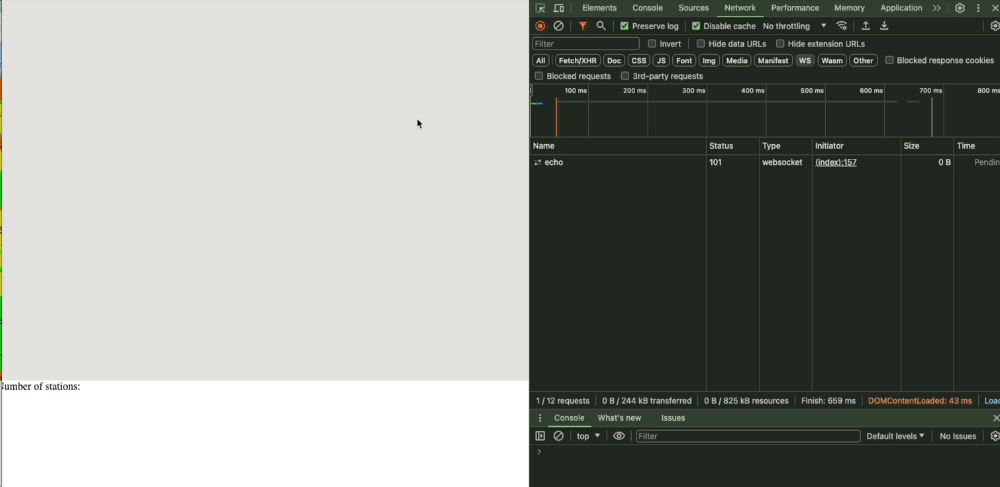

Citibike NYC demo
================================================================

## Build and run

### Provision Confluent Cloud components:

```shell
$ export export TF_VAR_confluent_cloud_api_key=<your Confluent Cloud API KEY>
$ export export TF_VAR_confluent_cloud_api_secret=<your Confluent Cloud API secret>
$ terraform init 
$ terraform apply 
```

### Run the frontend with Google maps:

```shell
$ cd citibike-gmaps
$ ./mvnw compile -Dgmap.key=<your Google Maps API key>
```

Then browse to  [http://localhost:8080](http://localhost:8080)



🙏Thanks to [David Araujo](https://github.com/davidaraujo) for the [initial version](https://github.com/davidaraujo/citibike).